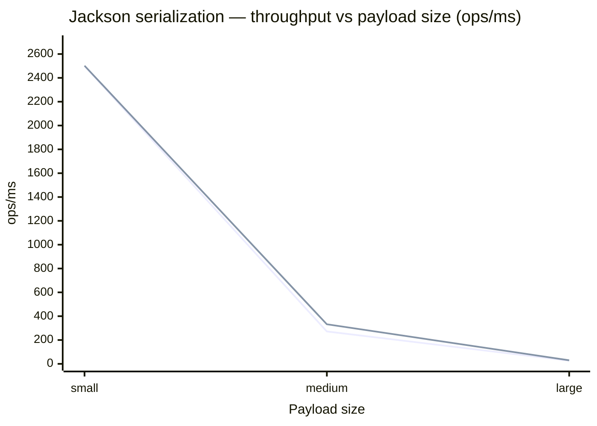

# benchmark-jackson — writeValueAsString vs writeValueAsBytes

Benchmarks two Jackson `ObjectMapper` serialization methods across three payload sizes to measure whether `writeValueAsString` incurs meaningful overhead over `writeValueAsBytes`.

## Methods Compared

| Method | What it does | Allocations per call |
|---|---|---|
| `writeValueAsBytes(obj)` | Serializes directly to `byte[]` | 1× `byte[]` + internal buffer |
| `writeValueAsString(obj)` | Serializes to `byte[]`, then copies into a new `String` | 1× `byte[]` + 1× `String` + internal buffer |

The hypothesis: the extra `byte[]` → `String` copy in `writeValueAsString` costs proportionally more as payload size grows.

## Payload Sizes

| Label | Line items | Approx. JSON size |
|---|---|---|
| `small` | 3 | ~200 B |
| `medium` | 30 | ~2 KB |
| `large` | 300 | ~20 KB |

## How to Run

```bash
# Build
mvn package -pl benchmark-jackson

# Run all benchmarks (outputs results to benchmark-jackson/results.json)
java -jar benchmark-jackson/target/benchmarks.jar -rf json -rff benchmark-jackson/results.json
```

## Environment

| Property | Value |
|---|---|
| JMH version | 1.37 |
| JVM | OpenJDK 64-Bit Server VM 21.0.6+7-LTS |
| Mode | Throughput (`thrpt`) |
| Unit | ops/ms |
| Warmup | 3 iterations × 1 s |
| Measurement | 5 iterations × 1 s |
| Forks | 1 |
| Threads | 1 |

## Results

> Date: 2026-04-07 · Mode: throughput (`thrpt`) · Unit: ops/ms · Higher is better

| Payload | `writeValueAsBytes` score | `writeValueAsBytes` ± error | `writeValueAsString` score | `writeValueAsString` ± error |
|---|---:|---:|---:|---:|
| small | 2,499 | 149 | 2,502 | 139 |
| medium | 272 | 75 | 332 | 56 |
| large | 26 | 2 | 30 | 3 |

### Throughput vs Payload Size



> Lines top-to-bottom: `writeValueAsString` · `writeValueAsBytes`

## Analysis

### `small` (~200 B) — no measurable difference

At small payload sizes both methods are statistically identical: 2,502 vs 2,499 ops/ms, well within each other's error margins. The copy overhead of `writeValueAsString` is too small relative to the fixed serialization cost to be visible.

### `medium` (~2 KB) — `writeValueAsString` is faster

Counterintuitively, `writeValueAsString` scores **22% higher** than `writeValueAsBytes` (332 vs 272 ops/ms). The error bars are wide (±75 for `writeValueAsBytes`, ±56 for `writeValueAsString`), so the results overlap. This is not a reliable performance difference.

### `large` (~20 KB) — `writeValueAsString` is still faster

The same pattern holds at large payload: `writeValueAsString` scores **14% higher** (30 vs 26 ops/ms). Again, error bars overlap (±3 vs ±2).

### Why the hypothesis didn't hold

The extra `String` allocation is real, but it is not the bottleneck at any of these sizes. The dominant cost is **JSON serialization itself** — field reflection, number formatting, buffer management — which dwarfs a single `memcpy`-equivalent. Jackson's `ByteArrayBuilder` also recycles its internal buffer via a `ThreadLocal`, so the `byte[]` underlying both methods is largely reused across calls.

The wider variance on `writeValueAsBytes` at medium/large sizes is likely an artifact of JVM JIT compilation decisions across the 5 measurement iterations rather than a systematic effect.

### Summary

| Payload | Recommendation |
|---|---|
| Any size | Choose based on what your call site needs — `byte[]` or `String`. The serialization cost is identical in practice. |
| Writing to a byte-oriented sink (HTTP, Kafka, file) | `writeValueAsBytes` avoids allocating a `String` you don't need, which reduces GC pressure even if throughput is the same. |
| Writing to a `String`-oriented API | `writeValueAsString` directly — converting `byte[]` → `String` yourself is no cheaper than letting Jackson do it. |
