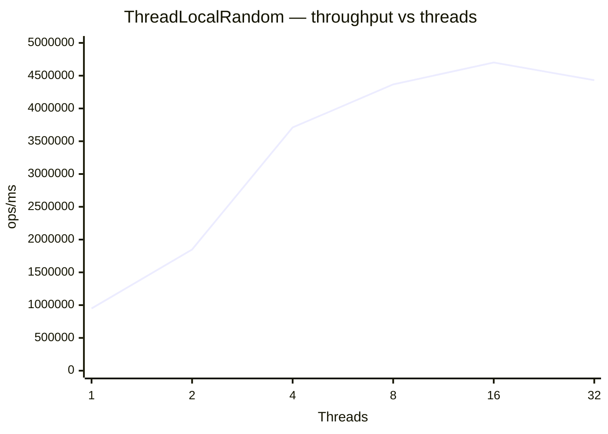
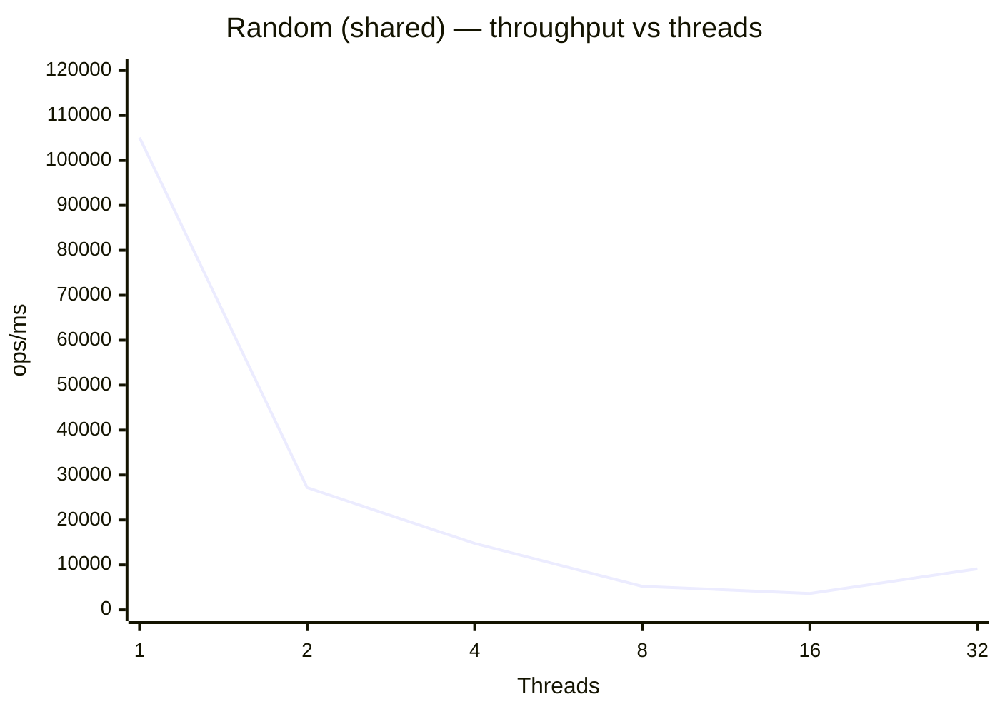

# benchmark-random — Random vs ThreadLocalRandom

Benchmarks `java.util.Random.nextLong()` against `ThreadLocalRandom.current().nextLong()` under increasing thread counts (1 / 2 / 4 / 8 / 16 / 32).

## Why They Differ

| | `Random` | `ThreadLocalRandom` |
|---|---|---|
| Seed storage | Shared `AtomicLong` | Per-thread field inside `Thread` |
| `nextLong()` cost | 2 CAS operations on shared state | Simple arithmetic, no sharing |
| Under contention | Threads spin-retry → throughput collapses | No contention → scales linearly |

A single `Random` instance is shared across all threads (via `@State(Scope.Benchmark)`) to reproduce real-world usage patterns.

## How to Run

```bash
# Build
mvn package -pl benchmark-random

# Run all benchmarks (outputs results to benchmark-random/results.json)
java -jar benchmark-random/target/benchmarks.jar -rf json -rff benchmark-random/results.json
```

## Environment

| Property | Value |
|---|---|
| JMH version | 1.37 |
| JVM | OpenJDK 64-Bit Server VM 21.0.6+7-LTS |
| Mode | Throughput (`thrpt`) |
| Unit | ops/ms |
| Warmup | 3 iterations × 1 s |
| Measurement | 5 iterations × 1 s |
| Forks | 1 |

## Results

> Date: 2026-04-02 · Mode: throughput (`thrpt`) · Unit: ops/ms · Higher is better

| Threads | `random` score | `random` ± error | `threadLocalRandom` score | `threadLocalRandom` ± error |
|---:|---:|---:|---:|---:|
| 1 | 105,111 | 14,905 | 948,702 | 167,018 |
| 2 | 27,196 | 2,816 | 1,848,628 | 212,513 |
| 4 | 14,775 | 3,272 | 3,709,909 | 673,487 |
| 8 | 5,236 | 1,685 | 4,366,720 | 509,306 |
| 16 | 3,644 | 4,161 | 4,700,588 | 2,733,177 |
| 32 | 9,104 | 6,949 | 4,431,161 | 1,786,050 |

### Throughput vs Thread Count

`threadLocalRandom` is **9–1200× faster** than `random` depending on thread count, so both series are plotted on their own chart.

**`ThreadLocalRandom` throughput (ops/ms)**



**`Random` throughput (ops/ms)**



## Analysis

**`ThreadLocalRandom` is faster by orders of magnitude at all thread counts:**

At 1 thread (no contention), `ThreadLocalRandom` is already **9× faster** (948 K ops/ms vs 105 K ops/ms). This baseline advantage is due to the absence of atomic operations entirely.

As thread count increases, `Random` throughput collapses:

| Threads | `Random` (ops/ms) | vs 1-thread baseline |
|---:|---:|---|
| 1 | 105,111 | baseline |
| 2 | 27,196 | −74% |
| 4 | 14,775 | −86% |
| 8 | 5,236 | −95% |
| 16 | 3,644 | −97% |

This is the classic CAS-contention death spiral: each `nextLong()` requires two CAS updates on the same `AtomicLong`; under contention, threads retry in a loop, burning CPU without making progress.

`ThreadLocalRandom` scales near-linearly up to ~8 threads (matching the core count of the test machine), then levels off as the CPU is saturated — but throughput never regresses.

**Recommendation:** Always prefer `ThreadLocalRandom` over a shared `Random` in multi-threaded code. The only valid use case for a shared `Random` is when you need a reproducible seed with deterministic output from a single thread.
