# benchmark-sample — String Concatenation Benchmark

Compares three approaches to building a string by appending integers in a loop:

| Approach | Description |
|---|---|
| `stringConcatenation` | `result += i` — naive `+=` operator, creates a new `String` object on every iteration |
| `stringBuilder` | `StringBuilder.append(i)` — single mutable buffer, minimal allocations |
| `stringJoiner` | `StringJoiner.add(String.valueOf(i))` — delimiter-aware variant of `StringBuilder` |

## How to Run

```bash
# Build
mvn package -pl benchmark-sample

# Run all benchmarks (outputs results to benchmark-sample/results.json)
java -jar benchmark-sample/target/benchmarks.jar -rf json -rff benchmark-sample/results.json
```

## Environment

| Property | Value |
|---|---|
| JMH version | 1.37 |
| JVM | OpenJDK 64-Bit Server VM 21.0.6+7-LTS |
| Mode | Average time (`avgt`) |
| Unit | nanoseconds/op |
| Warmup | 3 iterations × 1 s |
| Measurement | 5 iterations × 1 s |
| Forks | 1 |

## Results

> Date: 2026-04-02 · Mode: average time (`avgt`) · Unit: ns/op · Lower is better

| Iterations | `stringBuilder` score | `stringBuilder` ± error | `stringConcatenation` score | `stringConcatenation` ± error | `stringJoiner` score | `stringJoiner` ± error |
|---:|---:|---:|---:|---:|---:|---:|
| 10 | 38.897 | 2.436 | 83.160 | 8.578 | 105.211 | 10.894 |
| 100 | 255.062 | 23.790 | 995.426 | 213.540 | 1,003.249 | 75.560 |

### Average Time per Strategy

```mermaid
xychart-beta
    title "String building — average time (ns/op) · lower is better"
    x-axis "Iterations" [10, 100]
    y-axis "ns/op" 0 --> 1100
    bar [38.897, 255.062]
    bar [83.160, 995.426]
    bar [105.211, 1003.249]
```



> Bars left-to-right per group: `stringBuilder` · `stringConcatenation` · `stringJoiner`

## Analysis

**`StringBuilder` is the clear winner** at both iteration counts:

- At 10 iterations, `StringBuilder` (38.9 ns) is **2.1× faster** than `+=` (83.2 ns) and **2.7× faster** than `StringJoiner` (105.2 ns).
- At 100 iterations, the gap widens dramatically: `StringBuilder` (255 ns) is **3.9× faster** than `+=` (995 ns) and **3.9× faster** than `StringJoiner` (1003 ns).

**Why `+=` is slow:** Each `result += i` call creates a new `String` object, copies all previous characters into it, and discards the old string. This is O(n²) in total allocations — proportional to the square of iteration count. The jump from ~83 ns → ~995 ns (12×) as iterations go 10 → 100 (10×) confirms the quadratic allocation pattern.

**Why `StringJoiner` matches `+=` at scale:** `StringJoiner` wraps a `StringBuilder` internally, but `String.valueOf(i)` allocates a temporary `String` for every element before appending. At 100 iterations the combined cost of these temporary allocations makes it roughly equivalent to the `+=` path.

**Recommendation:** Prefer `StringBuilder` for any loop-based string building. Use `StringJoiner` only when you need delimiter/prefix/suffix semantics and are not in a tight loop.
