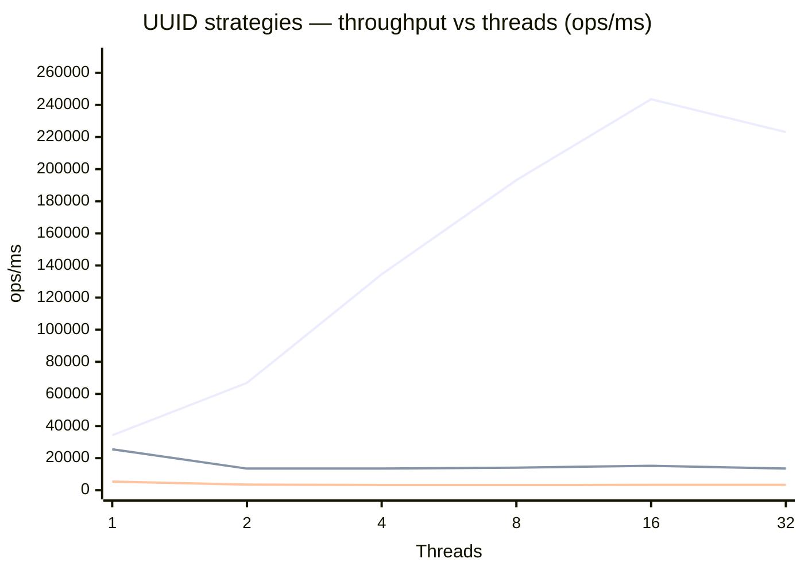

# benchmark-uuid — UUID vs Fast UUID vs ULID

Benchmarks three strategies for generating unique string IDs under increasing thread counts (1 / 2 / 4 / 8 / 16 / 32). Cryptographic security is explicitly **not** a goal; only uniqueness and throughput are measured.

## Strategies Compared

| Strategy | Description | Thread-safe? | Crypto-secure? | Sortable? |
|---|---|---|---|---|
| `UUID.randomUUID()` | Standard JDK UUID v4 backed by `SecureRandom` (global lock or per-thread entropy pool) | Yes | Yes | No |
| `fastUuid` | UUID v4 bit layout built from two `ThreadLocalRandom` longs — no `SecureRandom`, no contention | Yes | **No** | No |
| `ulid_monotonic` | 128-bit ULID (48-bit ms timestamp + 80-bit random). Uses `ulid-creator` library with `ThreadLocalRandom` internally; lexicographically sortable | Yes | No | **Yes** |

## How to Run

```bash
# Build
mvn package -pl benchmark-uuid

# Run all benchmarks (outputs results to benchmark-uuid/results.json)
java -jar benchmark-uuid/target/benchmarks.jar -rf json -rff benchmark-uuid/results.json
```

## Environment

| Property | Value |
|---|---|
| JMH version | 1.37 |
| JVM | OpenJDK 64-Bit Server VM 21.0.6+7-LTS |
| Mode | Throughput (`thrpt`) |
| Unit | ops/ms |
| Warmup | 3 iterations × 1 s |
| Measurement | 5 iterations × 1 s |
| Forks | 1 |

## Results

> Date: 2026-04-02 · Mode: throughput (`thrpt`) · Unit: ops/ms · Higher is better

| Threads | `uuid_randomUUID` score | `uuid_randomUUID` ± error | `uuid_fastUuid` score | `uuid_fastUuid` ± error | `ulid_monotonic` score | `ulid_monotonic` ± error |
|---:|---:|---:|---:|---:|---:|---:|
| 1 | 5,392 | 2,268 | 34,250 | 16,158 | 25,526 | 11,324 |
| 2 | 3,517 | 2,279 | 66,842 | 25,844 | 13,505 | 1,628 |
| 4 | 3,269 | 2,687 | 134,481 | 98,082 | 13,536 | 7,244 |
| 8 | 3,246 | 602 | 193,170 | 226,272 | 14,065 | 3,737 |
| 16 | 3,349 | 851 | 243,553 | 59,991 | 15,253 | 1,485 |
| 32 | 3,356 | 548 | 223,048 | 67,041 | 13,518 | 7,856 |

### Throughput vs Thread Count

`fastUuid` scales near-linearly while the other two strategies plateau, so both series are readable on a single chart.



> Lines top-to-bottom: `fastUuid` · `ulid_monotonic` · `uuid_randomUUID`

## Analysis

### `UUID.randomUUID()` — worst throughput, plateaus under contention

At 1 thread it achieves ~5,400 ops/ms. As soon as a second thread joins, throughput drops to ~3,500 ops/ms and never recovers regardless of thread count. This is consistent with a per-JVM entropy lock inside `SecureRandom`: once saturated, additional threads queue up and gain nothing.

### `fastUuid` — scales near-linearly, highest throughput

At 1 thread it is **6× faster** than `UUID.randomUUID()`. Throughput scales almost linearly with thread count up to ~16 threads, reaching **243,000 ops/ms** — roughly **73× faster** than `randomUUID` at 16 threads. The slight dip at 32 threads is CPU saturation, not algorithmic contention.

Trade-off: `fastUuid` is **not** cryptographically secure. Bit manipulation uses `ThreadLocalRandom` which is a deterministic PRNG. Do not use this when UUID unpredictability under adversarial conditions is required.

### `ulid_monotonic` — moderate throughput, lexicographic ordering

At 1 thread `ulid_monotonic` (~25,500 ops/ms) is close to `fastUuid` (~34,000 ops/ms). However, it plateaus at ~13,500–15,500 ops/ms across all multi-thread counts. This is because the monotonic ULID generator serialises within a millisecond to guarantee ordering (a single internal lock per millisecond window). It does not regress like `randomUUID`, but does not scale like `fastUuid` either.

The key benefit of ULID is **lexicographic sort order**: ULIDs generated later sort after earlier ones, making them ideal for database primary keys (no random B-tree fragmentation).

### Summary

| Use case | Recommendation |
|---|---|
| Need cryptographic security | `UUID.randomUUID()` |
| Need maximum throughput, no security requirement | `fastUuid` (ThreadLocalRandom-backed UUID v4) |
| Need sortable IDs (e.g. DB primary keys) | `ulid_monotonic` |
| Never | Shared `UUID.randomUUID()` in a hot multi-threaded path |
